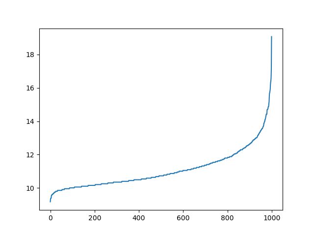

## 作业说明
Code.tar.gz 中包含了代码文件

ResultFile.tar.gz 中包含了包括所有聚类结果的 js 文件以及包含 K-means 和 DBSCAN结果
的文件。 还包括了当Minpts 为 2 3 4 时的 k - sil曲线 以及 K-means的 k - sil 曲线

轨迹可视化的网址在 [https://deadoggy.github.io/2017/04/07/数据挖掘第二次作业结果.html](https://deadoggy.github.io/2017/04/07/数据挖掘第二次作业结果.html)
(由于轨迹点过多， 有些类个数过少， 轨迹中颜色差别可能不太明显， 其中DBSCAN
  结果中噪声点没有被画在地图上)

两种算法的最好值也在上述网址上。

## 完成过程

### K-means
K-means 算法的完成难度不大， K的范围限定在 [2 , 100] 之间， 最好的聚类结果稳定在
K = 2 3 4 的时候，但是大部分的轨迹包含在同一个点中。Silhouette系数基本在 [ -0.1, 0.1] 之内徘徊， 可见轨迹的随机性比较大。

### DBSCAN
DBSCAN 算法完成 主要分为一下几个步骤：

 - 利用KNN计算所有点和最近的第四个点的距离
 - 将所有距离排序，得到如下图
  

 - 根据极大似然估计, 假设所有距离符合正态分布， 根据所有距离点计算均值和方差。

 - 利用均值和方差计算出现概率95%以内的距离范围。范围上下限在上图曲线斜率变化剧烈点左右，说明范围比较合理。

 - 由于范围是连续值， 以0.001或更小步长运算时间太长， 因此采用了先用0.5为步长计算。找到Sil系数最好的Eps （设为E1）, 然后在[E1-0.5, E1 +0.5]范围内以 0.05 为步长继续寻找最好值E2，然后根据精度的需要每次以上一次步长的 1/10 为步长进行计算寻找。

 以上步骤在代码中相应函数中均有注释说明。

 ###  GMM

 GMM选取了当MinPts为2时的DBSCAN的聚类结果进行比较。

 GMM和K-means的结果维持在92%左右， GMM和DBCAN的相似度维持在 96%左右。
 下面是其中一次的结果：

 

第一个是和K-means的相似度， 第二个是和DBSCAN的相似度。

## DBSCAN 和 K-means 的比较

DBSCNA 在 MinPts 为2 3 4 时Silhouette的系数最好时 Eps均为 13.7506 左右， sil系数的值均为 0.22 左右。 说明 Minpts的值对结果的影响并不大。
但是在 Eps为13.7506时DBSCAN的聚类结果都把数据分为了一类。 而当K的值最大时 ( 9 - 10 ), Eps则在9.75 到 9.8左右。

Kmeans 每次跑数据的结果并不完全相同， Sil值最好时只有0.07，但是K基本是2 3 4时最好。观察发现， 当K在2 3 4 时， 其实大部分轨迹是在一个类中，
只有个别轨迹被分到其他类中， 因此造成了sil系数并不如DBSCAN中的那么高。

比较两种聚类的结果，我认为这些轨迹数据分布比较均匀， 在地理上的类别区分并不明显。

A | B | C
--|--|---
as|bd|fd
qw|sd|dd
